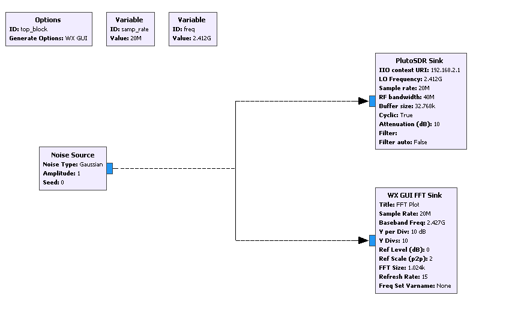
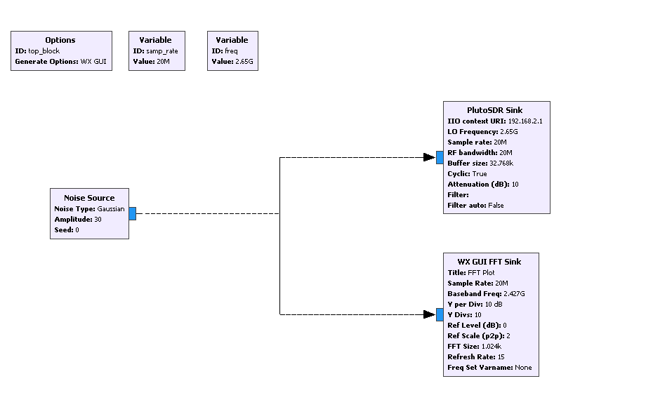
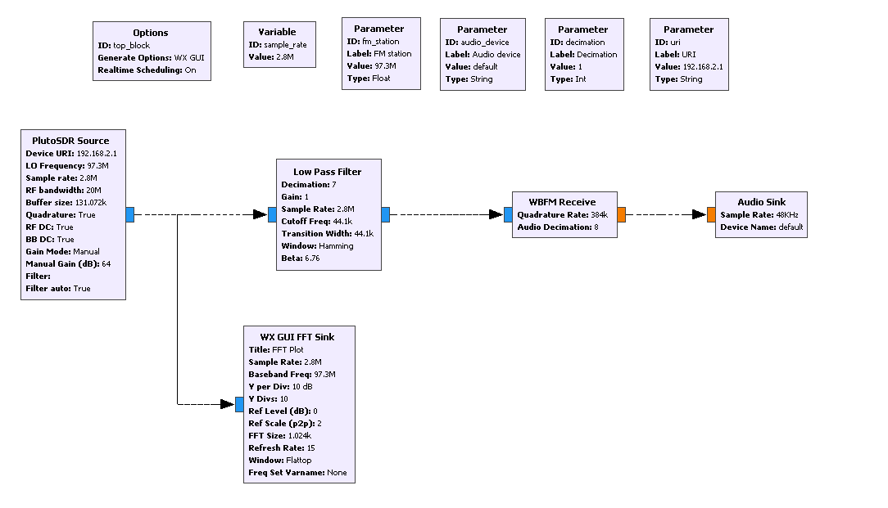
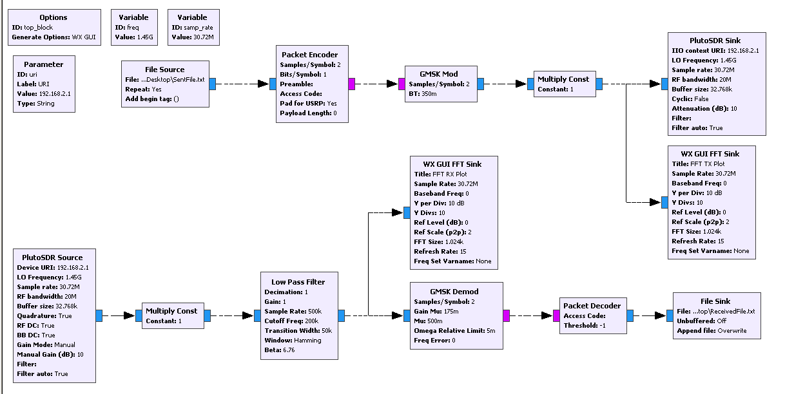

# Applications of Software Defined Radio in Wireless Communication
This repository consists of the projects that we completed using Software Defined Radio (SDR) for our Computer Networks Class.

### Authors:
**Roshan Poudel:** roshan.poudel<at>stonybrook.edu  
**Ulukbek Aitmatov:** ulukbek.aitmatov<at>stonybrook.edu

## Setup:
1. Windows 10
2. [GNU Radio Companion 3.7.13.4 with LLO](http://www.gcndevelopment.com/gnuradio/downloads.htm)
3. [ADALM PLUTO SDR](https://www.amazon.com/ANALOG-DEVICES-ADALM-Pluto-Software-Learning/dp/B079VXXKXR)

## WIFI Jammer:
The Wifi jammer is used to block wifi signals from any wifi device. While it cannot disconnect the device from its source, it blocks any incoming or outgoing packets from the blocked device by creating a noise that is stronger than that of the wifi transmitter, thus overpowering it and acting as if the Wifi Jammer is the Wifi transmitter. To block a certain wifi source, we first find the channel number and the corresponding frequency of the source. Then, we set the SDR to transmit a noise of same frequency as the Wifi Source.

## LTE Jammer:
The LTE Jammer uses a similar technique as the Wifi Jammer where we block the Downlink frequency used by the LTE. To find the downlink LTE freqency, we used an android app named LTE Discovery from the play store. The app showed that for LGU+ in South Korea, the downlink frequency hopped between 2650 MHZ, 2120 MHZ, and 889 MHZ. So, we used three SDRs and tuned it such that it blocks each of the SDR blocks one of these three frequencies. Doing so, our mobile phone could not connect to any other frequency, and thus the LTE signal was jammed. In this case, unlike in WIFI Jammer, the cellphone got disconnected from the Cellphone Tower as well.

## FM Radio Receiver:
The FM Radio receiver is used to receive the FM Radio signals from a radio station, and to demodulate the received signals, and convert it into audio. The RX antenna of the SDR was tuned to a FM Station frequency, usually in MHZ. 

## File Transmitter and Receiver:
For this part, we created two text files: `sentFile.txt` and `ReceivedFile.txt` The  `sentFile.txt` contains the text that we need to send via the SDR. The `ReceivedFile.txt` is usually empty with an option to append or overwrite to it. In this example, we are using a single SDR to send and receive the text file in Parallel. The TX antenna of the PLUTO SDR is used to send the file, and the RX antenna is used to receive it.

## Youtube Video Demonstration:

### Disclaimer:
We are no experts in SDR. Our knowledge of SDR is through this hit and trial project that we completed over a span of 3 days. Some of the configurations that we have made in these GRC files might not make sense to an expert in SDR. But these configurations worked for us with the above mentioned setup, and you may reproduce it using the GRC files provided. Also, the GRC file for File Transmitter and Receiver was received from [this github source](https://github.com/patel999jay/ADALM-Pluto-File-Transfer) 